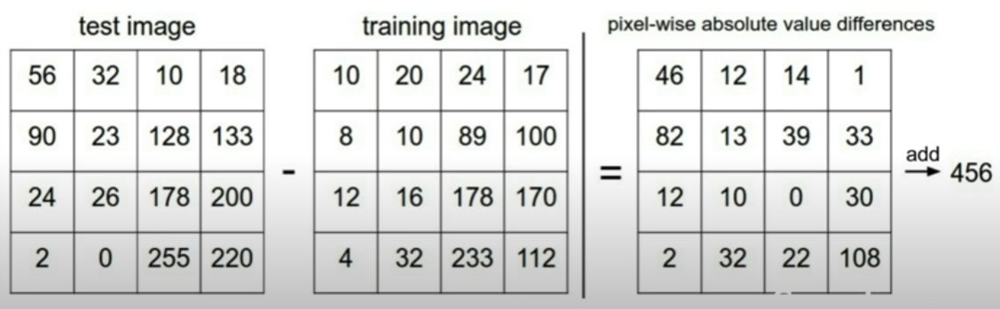

# 第二讲 —— 图像分类器

## 图像分类器的两个步骤
<br>

1. **训练模型**<br>
&emsp;&emsp;图像的识别不是凭空进行的，就像计算机的算法流程一样，图像作为算法的输入，类别作为算法的输出，整个算法本身这个黑箱就是我们需要训练的东西，我们需要找到一个模型，让它的输入输出映射关系和图像识别过程相吻合。

2. **预测图像**<br>
&emsp;&emsp;执行预测图像的过程，就是使用我们找到的模型，进行输入、处理和输出的过程。就像哈希算法把原数据处理成哈希值一样，通过模型，原图像的像素阵列经过计算变成一些分数值，然后我们通过比较每个类型的得分来评价这个图像应该属于哪个类别。

!!! note "一点联想"
    <div style = "margin-left:5%;margin-right:5%;">
    &emsp;&emsp;这其实很有意思，就像学校给我们分发测试试卷、改卷打分来给我们评价学习水平一样，我们综合机器每一块像素，给它们来打分，最后得出它应该属于哪一个类别。就像你政治考了90分，而物理只有60分，你会下意识判断你适合学文科而不适合学理科。<br>
    &emsp;&emsp;但是，我们都知道这只是一个概率判断。影响考试分数的因素太多了，我们不会通过仅仅一次考试来决定一个人是否适合学习文科或者学习理科。对图像也一样，当图像对于“猫”得分最高的时候，它大概率是猫，但是这必然是不能百分百地确定的。<br>
    &emsp;&emsp;尽管如此，但就像物理模型中使用了非常多的一阶近似也能准确预测自然界的变化，对于机器，也可以有这样的误差和近似。我们可以通过开发训练吻合率更高的模型，这样让错误降到可以容许的范围，让它做出高概率的预测，这样这个模型就比较可信了。说不定有一天，机器可以做到比人眼识别更精准。
    </div>

## L1距离（曼哈顿距离）

&emsp;&emsp;我们刚刚讲到，对图像进行分类，最重要的是对图像确定一个“打分标准”，得到这个图像在每一个分类的分数，方便后续的选择。L1距离就是一个经典的打分标准。

**L1距离公式：**
$$
    L_1 = \sum_{p_{ij} \in img}{|p_{ij}-q_{ij}|},q_{ij} = \text{constant}
$$

&emsp;&emsp;在上面的公式中，$q$是我们预先设置好的常数，也就是一个已知的图像，我们知道这个图像对应着什么，而L1距离就是把现在测试的图像和已知图像的像素值一一对应相减，然后进行求和，就像下面这个图显示的一样。



&emsp;&emsp;我们把这个计算出来的东西叫做“距离”，是因为它从某种角度上确实反映了测试图像和已知图像的差异，从抽象的角度来看就是一种距离，而且它符合差异越大，距离越远的直观。

### 模型训练——距离矩阵

&emsp;&emsp;因此，可以设想，如果我们手头有$N$个已知的对象，同时有$M$个需要验证的图像，我们一一计算它们之间距离，于是我们就可以得到一个 $M$行$N$列的矩阵，我们将它称作距离矩阵（distance matrix），通过比较每一行的距离，就可以得出每一个验证图像的预测类型。

### 最近邻居算法(NN)

&emsp;&emsp;根据直观感受，我们不妨做出这样的结论，我们认为如果两个图像的L1距离越小，那么这两个图像就越相似。对于测试图像，我们计算它对于每一个已知图像的已有距离，看看它和谁走得更近，就跟谁归为同一类——这就是最近邻居（Nearest Neighbour）算法。

```py title="NN.py" linenums="1"
import numpy as np

class NearestNeighbour:
    def __init__(self):
        pass
    
    def train(self,X,y):
    """ 注意，我们为了存储的方便，把图像的每一行拼接起来，这样就把二维的图像数据转化成了一维来存储。 """
    # X是一个M行N列的二维数组，M代表已知图的个数，N代表每个图的大小 
    # y是一个大小为M的一维数组，存储的是每一个图像所对应的类别
        self.Xtr = X
        self.ytr = y
    
    def predict(self,X):
    # 此处X是一个K行N列的二维数组，K代表需要测试图像的个数，N代表每个图的大小，这个N必须和Xtr中的N匹配
        num_test = X.shape[0]
        Ypred = np.zeros(num_test, dtype = self.ytr.dtype) # 初始化类型

        for i in xrange(num_test):
            # 计算 L1距离矩阵
            distances = np.sum(np.abs(self.Xtr - X[i,:]), axis = 1)
            # 寻找距离最小对应图像的下标
            min_index = np.argmin(distances)
            # 下标映射找到对应分类
            Ypred[i] = self.ytr[min_index]

        return Yred
```

??? question "一些关于代码的问题和解答"
    <div style = "margin-left:5%;margin-right:5%;">
    <div style = "font-size:16px">
    **一. 第16行的** `X.shape[0]` **是什么意思？**<br>
    </div>
    &emsp;&emsp;`X.shape`是一个numpy的函数，其中`X.shape[N]`代表的是读取变量X第N-1个维度的大小，这里的`X.shape[0]`就是读取行数，如果是`X.shape[1]`读取的就是列数。<br>
    &emsp;&emsp;更进一步地，如果拓展到更高维度的情况（我们很多时候都会使用多维数组），.shape[]函数就会非常方便。比如对于一个numpy的array变量，如果它是一个类似`X[A][B][C][D]`四维数组，由于python对规定变量的模糊化，我们不知道ABCD的具体值，我们就可以遍历`X.shape[0] ~ X.shape[3]` 来得到 A ~ D。特殊地，就像-1在数组中的使用一样，如果我们使用`X.shape[-1]`，它会返回最后一个维度的大小，也就是`X.shape[3]`。<br><br>
    <div style = "font-size:16px">
    **二、第17行的**`np.zeros()`**用来做什么？**<br>
    </div>
    &emsp;&emsp;就像我们在C语言中需要定义变量并且赋初值一样，在python中我们同时需要这样做，但是python会通过你赋的值来自动为变量判断类型，所以简化了变量的定义步骤。array是numpy库中的一个非常灵活的变量格式，通过array以及它附带的一些函数，可以判断整个数组的维度、大小，甚至可以做局部求和、转置、矩阵乘法等等，而对array赋初值就可以使用`np.zeros(tuple,type)`得到一个确定大小的、整体的赋零数组。tuple代表的是整个array的形状，比如`(5,2,3)`得出来的就是数组`a[5][2][3]`，type就是数组的数据类型。<br><br>
    <div style = "font-size:16px">
    **三、第21行的`X[i, :]`是什么意思？**<br>
    </div>
    &emsp;&emsp;这是python中的一种省略形式，首先，对于符号`:`本身，它本身代表范围的选取，比如`[2:5]`选取的就是 `[2]`、`[3]`和`[4]`，即$[2,5)$区间的所有整数号。而如果把前面的2省去，则默认从下标0开始，如果后面的5被省去，则默认在最后一个元素结束。因此，当第二维度仅有`:`时，前后数字都被省去，因此这个选取是从0到最后一个元素，因此是选中了一整行。<br><br>
    <div style = "font-size:16px">
    **三、第21行的`axis = 1`是什么意思？**<br>
    </div> 
    &emsp;&emsp; `axis`是`np.sum()`中的一个参数，而函数`np.sum()`是把数组的某几个维度的数字全部加起来，像是做一些投影操作，把整个数组降了若干个维度。这个axis就是对应的维度。比如有三维数组，我们想要把它的最后一个个维度全部加起来，就可以设置参数`axis = -1`。在这个例程中，把axis设置为1，这意味着求和将在序号1的维度进行，也就是这个二维数组的每一行进行求和。
    </div>

## L2距离（欧氏距离）

&emsp;&emsp;直接地把各个像素的差距相加似乎违背我们对距离的认识，就像我向东走了100米，向北走了100米，这并不意味着我们走到了距离原点200米的地方。因此，L2距离运用了欧氏空间的刻画，将每一个像素看作一个维度，然后计算多维空间中的距离。

**L2距离公式：**

$$
    L_2 = \sqrt{\sum_{p_{ij} \in img}(p_{ij} - q_{ij})^2}, q_{ij} = \text{constant}
$$

!!! info "L2距离和运行优化"
    <div style = "margin-left:5%;margin-right:5%;margin-top:3%;margin-bottom:3%">
    因为L2距离的公式特性，在实际应用中通过一定的拆分，可以大大优化程序的运行速度。[查看具体优化](#nn)
    </div>

## 前K最近邻居算法（KNN）

&emsp;&emsp;在先前的**[最近邻居算法](#nn)**中，我们直接采用最近的邻居作为我们图像的分类依据。这很方便，但是它对于一些边界情况的判断是非常糟糕的。比如，如果我们用二维平面的格点来表示已知的点，并用颜色来表示它们的类型，而让点与点间的距离来表示图像间的距离（这样的表示并不完全合适，但是至少可以说明问题），我们会得到如下的图：

<center>

</center>

&emsp;&emsp;我们可以看到，类与类之间的间距是十分粗糙的，存在非常多的锯齿，锯齿意味着一点微小的差异就会让预测结果天差地别，这是我们不想看到的，另外可以观察到的是在绿色类中间有一块“飞地”，但是我们的直觉会告诉我们这是一种极其特殊的情况，一般根据规律性来看，中间应该仍然是绿色类。<br>
&emsp;&emsp;因此，为了抹平边界让其变得更加光滑符合直觉，提高整个模型的准确性并且增加对极端情况的耐受度，进一步地提出了前K最近邻居算法（K-Nearest-Neighbour）。<br>
&emsp;&emsp;顾名思义，前K最近邻居算法没有把数据参考设置在一个点上，而是先选取最近的K个点，然后根据这K个点综合进行判断。比如，$K=5$，取五个点，四个点是绿色，一个点是黄色，那么因为绿色点最多，输出结果就是绿色。 <br><br>
&emsp;&emsp;[KNN算法代码]()  <br><br>
&emsp;&emsp;执行这种算法过后，我们可以重新观察边界中的情况，我们看到出现了一些“白色”区域，这些是因为在这片区域前K个最近邻居中存在多个最多类型，无法进行判断。但是，同时可以发现，边界的锯齿情况得到了极大的改善，而绿色块中间的“飞地”也消失了。

<center>

</center>

### 选取最佳超参数（Hyperparameter）

&emsp;&emsp;超参数是不由外界输入，而由程序内部需要手动设置的参数，它会影响整个程序的进程。在KNN算法中，这个超参数就是K。而我们知道，我们不能用同一个K去训练不同的模型，<del>这样可能会犯下教条主义错误</del>。所以针对一组数据集，我们需要通过一些手段，量身订造地判断最合适的K。<br>
&emsp;&emsp;目前，我们能想到的最暴力的方式就是尝试着代入一些K来验证哪个K能达到最好的预测效果。

!!! example "选取超参数的一些方式"
    === "所有的数据作为训练数据"
        <div style = "margin-left:5%;margin-right:5%;margin-top:3%;margin-bottom:3%">
        &emsp;&emsp;我们如果选择All in，把手上所有的数据全部当作训练数据，虽然这会一定程度上（虽然程度很小）增加模型的可靠性，但是我们没有办法在测试的时候去验证。选取K的时候，$K=1$的成功预测率一定是$100\%$，因为我们用任意手头的数据去验证，总有一个已知点和这个数据的距离为$0$（因为它已经被包含在模型当中了）。所以，这样选取K的方式是不能够选出最优的K的。
        <center>
        
        </center>
        </div>
    === "分割数据集为训练集和测试集"
        <div style = "margin-left:5%;margin-right:5%;margin-top:3%;margin-bottom:3%">
        &emsp;&emsp;这种方式相比于上一个全部投入的方法，起码给我们提供了一个可以验证原有数据集是否可行的方式，让我们走出了完全黑箱开盲盒的困扰。但是，这种方式就好比考试结束的自我估分。经过验算，我们都觉得自己能考一个非常不错的分数，但是考试后我们往往会发现实际成绩要比我们的预测成绩要低。用这种方式测试模型也是一样，我们只是验证了K在这种特定验证集下是准确的，但我们无法确定当它被真正地拿到应用场景时会变成什么样子。
        <center>
        
        </center>
        </div>
    === "分割数据集为训练集、验证集和测试集"
        <div style = "margin-left:5%;margin-right:5%;margin-top:3%;margin-bottom:3%">
        &emsp;&emsp;这种方式又增加了一个验证集。验证集好比拉了一个同学来讨论题目，通过他的方法来验算自己的方法。这种方式无疑会显著地提高答案的可靠性。总之，这种方式需要保证测试集是完全随机的，用来模拟真实的应用情况，先用验证集验证得到K，完成模型，然后再把这个模型用来验证测试集，进一步验证它的正确性。
        <center>
        
        </center>
        </div>

### 交叉验证训练

&emsp;&emsp;通过刚才的讨论，我们知道我们可以通过分割数据集来比较精确地验证模型的正确性。我们当然希望模型能通过验证得到一个很好的结果，但是<del>理想是丰满的，道路是曲折的</del>我们总会遇见模型精确度不高的问题。这个时候我们因为使用了所有的数据，只能够推倒重来，使用新的数据集。<br>
&emsp;&emsp;交叉验证训练可以较大程度地缓解这个问题。在交叉训练中，我们首先挑选出测试集，保证它的随机性，然后把剩下的数据分成若干个数据块，我们选取其中的一个数据块作为验证集，而剩下的作为训练集。所以，如果我们有五块这样的数据块，我们就可以有五个不同的训练集，选择更多，选到高准确度模型的可能就越大。


